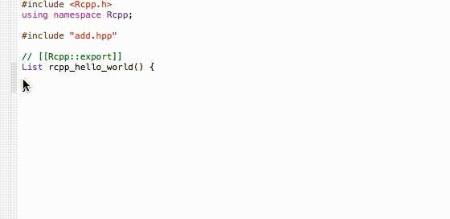

<style>
body {
margin-top: 40px;
margin-bottom: 40px;
}
code {
white-space: pre-wrap;
word-wrap: normal;
}
</style>

<a href="https://twitter.com/share" class="twitter-share-button" data-text="#cmaker : setup C/C++ develop environment for R package" data-via="" data-hashtags="">Tweet</a>
<script>!function(d,s,id){var js,fjs=d.getElementsByTagName(s)[0],p=/^http:/.test(d.location)?'http':'https';if(!d.getElementById(id)){js=d.createElement(s);js.id=id;js.src=p+'://platform.twitter.com/widgets.js';fjs.parentNode.insertBefore(js,fjs);}}(document, 'script', 'twitter-wjs');</script>

Powered by `CMake`, the R package `cmaker` setups C/C++ develop
environment for R package, to enjoy auto-complete, code navigation,
parallel compiling and other features of IDE. Not convinced? Watch
Xcode in action and give it a try. All the generated files are stored
in sub-directory `proj/` and `cmake/` besides `CMakeList.txt` in
package root directory, so it can be cleaned easily if not
satisfied. Testing, suggestion, and pull request are welcome.



# Usage

__The IDE project generated by `cmaker` is for development of R
package only. Always check and build R package following CRAN document
before release.__

You may copy the example from `cmaker` to set a playground with the
following R command

```r
file.copy(from = system.file("examples/rcppexample", package = "cmaker"),
          to = ".", recursive = TRUE)
```

`cmaker` only take care of the C/C++ source files, and R files should
be edited in other editors, such as [RStudio](http://www.rstudio.com/)
or [Emacs/ESS](http://ess.r-project.org/).

- `ls_IDEs()`{.r} to get recommend IDEs for your system.
- `add_cmake("pkg_dir", language = "CXX", cxx_standard = "98",
compileAttributes = TRUE)`{.r} to generate cmake files for the R
package.
- `generate_project("pkg_dir", "IDE_name")`{.r} to generate project for your preferred IDE.
- Open IDE and enjoy.
- When you are ready, build within IDE.
- Call `load_asis("pkg_dir")`{.r} to load the package. `load_asis`{.r} works
  the same way as `devtools::load_all`, but assuming the dynamic
  library has been built properly.

# Install

__Windows is not supported yet due to complexity of compiling R packages in Windows. Will be supported soon. Please stay tuned.__

## System requirements

`r cmaker` depends on [CMake](http://www.cmake.org) and
[ninja](https://martine.github.io/ninja/). The newest versions are
recommended.

- Mac users may install them
through [MacPorts](https://www.macports.org/) or
[Homebrew](http://brew.sh/), with command
```bash
port install cmake ninja
```
or
```bash
brew install cmake ninja
```
- Linux users may install them through package management tools. You
  may need [PPA](https://launchpad.net/ubuntu/+ppas) or something similar to install the newest version.

## Install the package

`cmaker` require `devtools (>= 1.7.0.9000)`, which is not on CRAN
yet. Install newest `devtools` from github, and then install `cmaker`
from github. The following R script installs them automatically.

- Mac and Linux
```r
if (! "devtools" %in% installed.packages())
  install.packages("devtools")
if (packageVersion("devtools") < "1.7.0.9000") {
  ## The head of master branch is borken at time of writting.
  ## Install devtools 1.7.0.9000
  devtools::install_github("hadley/devtools", ref = "4d0964a1")
}
devtools::install_github("luckyrandom/cmaker")
```

<a href="https://github.com/luckyrandom/cmaker">

</a>

<script>
  (function(i,s,o,g,r,a,m){i['GoogleAnalyticsObject']=r;i[r]=i[r]||function(){
  (i[r].q=i[r].q||[]).push(arguments)},i[r].l=1*new Date();a=s.createElement(o),
  m=s.getElementsByTagName(o)[0];a.async=1;a.src=g;m.parentNode.insertBefore(a,m)
  })(window,document,'script','//www.google-analytics.com/analytics.js','ga');
  ga('create', 'UA-62238615-2', 'auto');
  ga('send', 'pageview');
</script>
